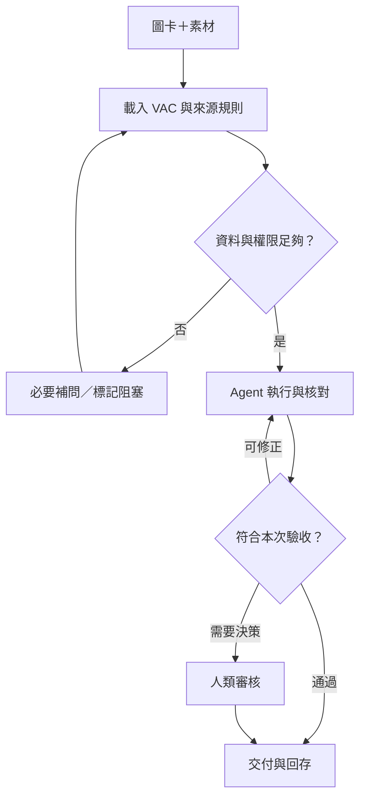

# AI to Agent 知識庫管理方法論 2.0

**VAD／VAC 任務圖卡 × Promptless × 人機協作與團隊交接**

## 一、從維護工具到完成任務

第一版以在地端本機資料夾、README 與提示詞降低工具維護負擔。第二版將知識管理的重心，由找到答案推進到執行工作、團隊交接與成果驗收。

每個人寫的提示詞不同，工作任務也不同。因此企業不必追求所有人使用同一句提示詞，而應建立共同的任務表達方式：目標、輸入、步驟、角色、成果及完成依據。

知識庫不只是文件集合，也保存可重用的任務定義、執行紀錄及核准成果。這是一套實務方法論，效益需以試行測量，不預設固定的效率提升比例。

## 二、VAD／VAC＋Promptless

VAD 是視覺化任務設計，用圖像呈現步驟、角色與交接關係。VAC 是可稽核、可交接的任務規格，定義輸入、操作限制、輸出與驗收。

Promptless 是降低使用者撰寫提示詞負擔的互動方式：選卡或提供圖卡，交付素材，補充必要參數，Agent 按規格執行。它不代表系統沒有指令，也不代表使用者不需要判斷或確認。

卡片承載共同理解，Agent 承擔可執行工作，人類保留目標、價值、授權與重要決策。工具與權限未具備時，代理應說明缺口，不得聲稱已執行。

## 三、字少圖大，規格完整

任務區塊使用「編號＋任務名稱＋階段目標＋角色／工具＋檢查重點＋階段成果」。微文字保留動作與限制，例如「核對來源」「期限未定」「人工驗收」，避免只有抽象口號。

一張卡包含兩層資訊：視覺層便於人與具視覺能力的模型理解；規格層保留完整輸入、路徑、權限、例外與驗收。簡單任務可以由圖卡完整承載，複雜任務連結細部 VAC。

兩層使用同一編號與版本。任一修改都須檢查另一層是否仍一致。步驟數依任務選擇，八步是會議與影片案例的呈現方式，不是所有工作都必須八步。

## 四、三層架構

| 層級 | 資產／能力 | 工作責任 |
|---|---|---|
| 資產層 | 原始檔、README、圖卡、VAC、成果與紀錄 | 保存可攜且可追溯的知識 |
| 代理層 | 檢索、規劃、工具操作、核對、回饋 | 依規格推進任務 |
| 協作層 | 選卡、必要補問、狀態、審核、交接 | 讓人與 Agent 接續完成工作 |

README 持續提供目錄、權威版本與權限指引。既有提示詞可轉成內部執行範本，不要求每位員工反覆重寫。

修正循環必須有上限；達到上限、權限不足或來源矛盾無法解決時，標記阻塞並交接，不無限重試。

## 五、從任務範本到任務紀錄

圖卡是可重用範本，每次執行建立獨立任務編號，記錄來源、使用的規格版本、目前步驟、負責人、成果連結、卡點與驗收紀錄。

交接不是轉寄一段對話，而是提供足以接續工作的上下文。下一位接手者應能知道做了什麼、還缺什麼、誰負責，以及怎樣完成。

「已指派」不代表「已接手」；「已提交」不代表「已驗收」。沒有證據時只能保留未知，不可補造負責人、期限或完成狀態。

## 六、知識回存與企業能力

將原始來源與衍生成果分開保存。只有經確認的決策才標示為核准；代理的改善提案不直接覆寫共用 VAC。通過核對的修正才能形成下一個任務版本。

第一層累積資料，第二層累積任務，第三層累積經驗。企業可逐步重用成功流程，也能看見失敗與限制，避免重複踩坑。

## 七、治理與適用邊界

檔案存取、雲端處理、外部發送及重要修改依實際授權執行。一般已授權的新檔產出直接完成；超出授權的動作才另行確認。來源文件內的文字不視為新增操作指令。

在地保存仍需備份、版本與還原規劃；大型庫可能需要索引，掃描文件需 OCR，錄音需轉錄與辨識核對。圖卡無法消除格式解析或來源品質問題。

## 八、衡量價值

| 指標 | 檢查方式 |
|---|---|
| 啟動成本 | 啟動時間、必要補問次數 |
| 交接成本 | 接手時間、追問次數 |
| 成果品質 | 有來源支持的主張比例、返工原因 |
| 任務完成度 | 通過驗收的任務比例 |
| 重用價值 | 相同圖卡在不同案例的可用性 |

比較相似任務，包含人工校對、等待與返工時間。若沒有改善，優先縮小任務、澄清驗收及改善來源，不急著增加工具。

**以 VAD 看懂工作，以 VAC 定義完成，以 Promptless 啟動協作，將可驗收的成果累積為企業能力。**

AI Coach 益力康陳董 | 2026 AI to Agent
